[](https://github.com/EdinaPrado/ResilientOps--Cloud/actions/workflows/ci.yml)

# ResilientOps Cloud


Projeto de portfólio de **SRE / DevOps**: uma API em Python empacotada em container, rodando em Kubernetes com autoscaling, infraestrutura provisionada com Terraform e observabilidade com Prometheus, Alertmanager e Grafana. Tudo roda localmente, em um cluster **kind**.

**Autora:** Edina

## O que o projeto demonstra

- **Infraestrutura como código:** cluster kind, metrics-server e stack de observabilidade criados por Terraform (providers `tehcyx/kind` e `hashicorp/helm`).
- **Container seguro:** imagem enxuta, executando como usuário não-root, com filesystem somente leitura.
- **Kubernetes pronto para produção (no que cabe num laboratório):** probes, limites de recursos, rolling update sem downtime, PodDisruptionBudget, HPA e distribuição de pods entre nodes.
- **Observabilidade:** métricas RED (taxa de requisições, erros e duração), SLIs gravados como *recording rules*, alertas e dashboard no Grafana.
- **Engenharia de confiabilidade na prática:** a API tem endpoints que simulam carga de CPU e falhas, para testar autoscaling e alertas de forma controlada.

## Arquitetura

```mermaid
flowchart LR
    U["curl / navegador"] -->|localhost:30000| SVC["Service NodePort"]

    subgraph KIND["Cluster kind (criado pelo Terraform)"]
        SVC --> P1["Pod da API"]
        SVC --> P2["Pod da API"]
        HPA["HPA: 2 a 5 réplicas"] -.->|escala| P1
        MS["metrics-server"] -.->|CPU e memória| HPA
        PROM["Prometheus"] -.->|scrape /metrics| P1
        PROM -.->|scrape /metrics| P2
        PROM --> AM["Alertmanager"]
        PROM --> GF["Grafana"]
    end
```



## Estrutura do repositório

```
.
├── app/                    # API FastAPI
│   ├── app.py
│   └── requirements.txt
├── docker/
│   └── Dockerfile          # imagem não-root, escuta em 0.0.0.0:8000
├── k8s/
│   ├── deployment.yaml     # Deployment + Service (NodePort 30000) + PodDisruptionBudget
│   ├── hpa.yaml            # HorizontalPodAutoscaler (CPU 70%, memória 80%)
│   └── monitoring/
│       ├── servicemonitor.yaml
│       ├── prometheusrule.yaml
│       └── grafana-dashboard.yaml
├── terraform/
│   ├── versions.tf
│   ├── variables.tf
│   ├── main.tf             # cluster kind + metrics-server
│   ├── observability.tf    # kube-prometheus-stack
│   └── outputs.tf
├── .dockerignore
└── .gitignore
```

## Endpoints da API

| Endpoint   | Descrição                                                        |
|------------|------------------------------------------------------------------|
| `/`        | Resposta normal, com latência simulada de 10 a 50 ms             |
| `/heavy`   | Consome CPU por 200 ms por requisição (usado para testar o HPA)  |
| `/error`   | Retorna HTTP 500 de propósito (usado para testar os alertas)     |
| `/healthz` | Probe de saúde do Kubernetes (readiness, liveness e startup)     |
| `/metrics` | Métricas no formato Prometheus                                   |

## Como executar

### Pré-requisitos

Docker, `kind`, `kubectl`, Terraform (1.5 ou superior) e Helm. Em WSL2, aumente o limite de instâncias do inotify antes de criar o cluster, senão o `kubeadm` pode travar (o valor é perdido quando o WSL reinicia):

```bash
sudo sysctl fs.inotify.max_user_instances=512
sudo sysctl fs.inotify.max_user_watches=524288
```

### 1. Cluster e stack de observabilidade (Terraform)

```bash
cd terraform
terraform init
terraform apply
cd ..
kind export kubeconfig --name resilientops
kubectl get nodes
```

A instalação do Prometheus e do Grafana leva alguns minutos. Para um cluster mais leve, use `terraform apply -var install_observability=false`.

### 2. Imagem e aplicação

```bash
docker build -f docker/Dockerfile -t resilientops-app:v1 .
kind load docker-image resilientops-app:v1 --name resilientops
kubectl apply -f k8s/deployment.yaml -f k8s/hpa.yaml
kubectl rollout status deployment/resilientops-app
curl localhost:30000/healthz
```

### 3. Monitoramento

```bash
kubectl apply -f k8s/monitoring/
```

Acesso às interfaces (cada comando em um terminal):

```bash
# Grafana em http://localhost:3000 (usuário: admin)
kubectl port-forward -n monitoring svc/kube-prometheus-stack-grafana 3000:80
kubectl get secret -n monitoring kube-prometheus-stack-grafana -o jsonpath="{.data.admin-password}" | base64 -d; echo

# Prometheus em http://localhost:9090
kubectl port-forward -n monitoring svc/kube-prometheus-stack-prometheus 9090:9090

# Alertmanager em http://localhost:9093
kubectl port-forward -n monitoring svc/kube-prometheus-stack-alertmanager 9093:9093
```

O dashboard **ResilientOps - Visão geral** aparece no Grafana em *Dashboards*.

## Testes de confiabilidade

### Autoscaling (HPA)

```bash
kubectl get hpa -w     # em um terminal

# em outro terminal: 3 minutos de carga, terminando sozinho
timeout 180 bash -c 'seq 1 100000 | xargs -P 20 -I{} curl -s -o /dev/null localhost:30000/heavy'
```

O uso de CPU passa de 70% e as réplicas sobem de 2 até 5. Depois da carga, o HPA espera 5 minutos antes de reduzir.

### Alerta de taxa de erro

```bash
timeout 240 bash -c 'while true; do curl -s -o /dev/null localhost:30000/error; curl -s -o /dev/null localhost:30000/; sleep 0.2; done'
```

Com cerca de 50% das requisições falhando, o alerta `ResilientOpsHighErrorRate` passa para *Pending* e, depois de 2 minutos, para *Firing* (visível em `http://localhost:9090/alerts` e no Alertmanager).

## Alertas e SLIs

| Alerta                         | Condição                                          | Gravidade |
|--------------------------------|---------------------------------------------------|-----------|
| `ResilientOpsAppDown`          | nenhum pod respondendo ao scrape por 1 minuto     | critical  |
| `ResilientOpsHighErrorRate`    | mais de 5% de respostas 5xx por 2 minutos         | critical  |
| `ResilientOpsHighLatencyP95`   | latência p95 acima de 500 ms por 5 minutos        | warning   |
| `ResilientOpsHPAAtMaxReplicas` | HPA no máximo de réplicas por 10 minutos          | warning   |

Regras de gravação (*recording rules*): taxa de requisições, razão de erros e latência p95, todas em janela de 5 minutos.

## Decisões de projeto

- **kind em vez de um cluster na nuvem:** custo zero e ciclo de teste rápido. O Terraform mantém o ambiente reproduzível.
- **Segurança do pod:** `runAsNonRoot`, `readOnlyRootFilesystem`, `capabilities: drop ALL`, `seccompProfile: RuntimeDefault` e sem token de ServiceAccount montado.
- **Deploy sem downtime:** `maxUnavailable: 0`, `preStop` com pausa curta e `startupProbe` para o liveness não reiniciar o app durante a inicialização.
- **Kubeconfig fora do repositório:** o Terraform grava em `~/.kube/resilientops-config`, porque o arquivo contém a chave privada do cluster.
- **Stack de observabilidade enxuta:** `node-exporter` e os monitores de componentes do control-plane do kind ficam desligados, para reduzir consumo de memória e alertas falsos.

## Aprendizados

- Em WSL2, o limite padrão de `fs.inotify.max_user_instances` (128) faz o `kind` falhar com vários clusters ativos.
- O `terraform.tfstate`, o `.terraform/` e os kubeconfigs nunca devem ir para o Git, e uma pasta de nuvem sincronizada não substitui um commit.
- O HPA calcula a utilização sobre o *request*, não sobre o *limit*, então requests muito baixos fazem o autoscaling disparar cedo demais.

## Limpeza

```bash
kubectl delete -f k8s/monitoring/ -f k8s/hpa.yaml -f k8s/deployment.yaml
cd terraform && terraform destroy
```

## Próximos passos

- Pipeline no GitLab CI: lint dos manifests, `terraform validate`, build da imagem e testes.
- Definir SLOs formais (disponibilidade e latência) com alertas de *burn rate*.
- Traces distribuídos com OpenTelemetry.